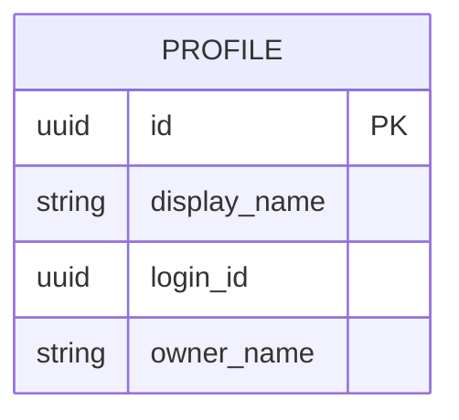
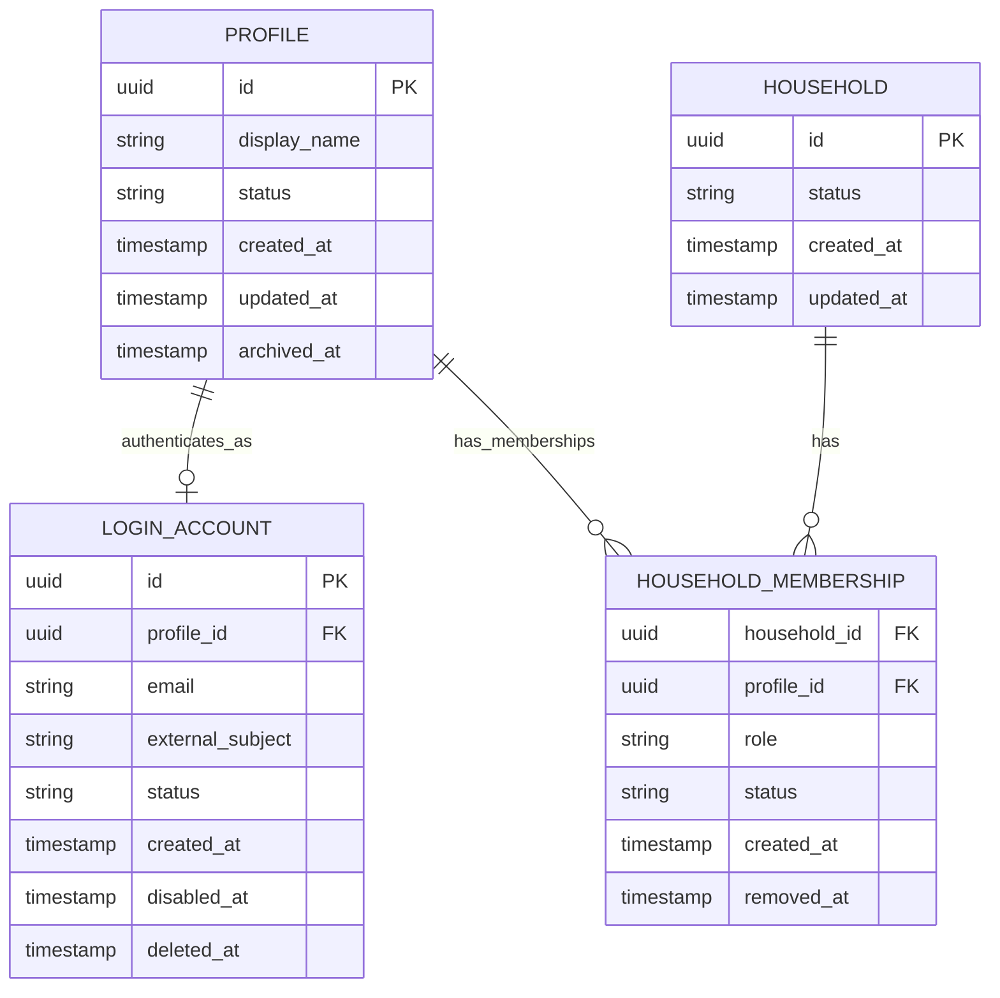

# Household Access System

This repository explores how to separate identity, authentication, household membership, and authorization in a live backend system. The design emphasizes relational data modeling, secure authorization, zero-downtime migration, incremental rollout, and clear deletion and retention semantics.

This is a design-first prototype. The current repository contains scaffolded Go packages and documentation only; implementation will validate the assumptions described here.

## Problem Statement

The legacy system stores people in a single `profiles` table. Each profile has a nullable `login_id`, and that field has accumulated several meanings:

- the person represented by the profile
- whether the person can authenticate
- the household boundary used for authorization

Rows sharing the same `login_id` are implicitly treated as one household.



This coupling makes common workflows difficult or unsafe. Staff-created profiles without logins cannot naturally belong to a household. A household owner cannot exist without a login. A non-owner member cannot independently have their own login. Permission checks are duplicated throughout the application by comparing `login_id` values, and the household owner is stored as a text name rather than a relational reference.

The result is a fragile authorization model where household access can be broadened accidentally, especially during migration or when legacy records are incomplete.

## Design Goals

- Separate authentication from the person represented by a profile.
- Allow profiles with or without login accounts.
- Represent households as explicit entities.
- Store household ownership as a profile relationship, not a name string.
- Allow exactly one active owner profile per active household.
- Permit the owner profile to have no login.
- Permit non-owner members to have their own login.
- Allow any active login associated with an active household profile to manage all active profiles in that household.
- Prevent a login from accessing or discovering profiles in another household.
- Support production migration without downtime.
- Ensure unexplained new-model access is never broader than legacy authorization during rollout.
- Keep authorization centralized and queryable rather than scattered across handlers.

Non-goals for this prototype:

- full authentication-provider implementation
- password storage
- frontend UI
- production healthcare-data modeling
- comprehensive delegated permissions outside household-wide access

## Proposed Data Model



### `profiles`

`profiles` represents real people and their retained business or healthcare data. A profile does not store credentials and does not use a login identifier as its household grouping key. Lifecycle states such as `active` and `archived` allow business records to be retained after authentication is disabled or removed.

### `login_accounts`

`login_accounts` represents the ability to authenticate. In this design, a profile has zero or one login account row, and that row transitions through lifecycle states such as `active`, `disabled`, and `deleted`. Each login account belongs to exactly one profile. Authentication can be disabled or deleted without deleting the profile. Passwords are assumed to be handled by an identity provider and are intentionally not modeled here.

Email or external subject uniqueness should apply where appropriate for login accounts and lifecycle state. For example, a deleted account may retain minimal audit metadata while preventing the credential from authenticating.

### `households`

`households` represents the explicit household boundary. Authorization is derived from active membership in this entity rather than from names, request input, or shared login identifiers.

### `household_memberships`

`household_memberships` associates profiles with households. A profile may have multiple historical membership records, but each active membership has role `owner` or `member`. A partial unique index permits at most one active membership per profile, and each household has exactly one active owner.

A partial unique index can enforce at most one active owner per household. It cannot, by itself, guarantee that every active household has an owner after every intermediate statement. Household creation, ownership transfer, and membership changes must run through centralized service operations inside database transactions. After backfill, a deferred constraint trigger or equivalent validation can enforce that every active household has one active owner at transaction commit.

There is no separate `household_access` table. Access is derived from the current relational model:

```text
login account
    -> authenticated profile
    -> active household membership
    -> household
    -> all active memberships
    -> manageable profiles
```

This avoids duplicating permission grants for the current requirement: all active logins associated with active profiles in a household can manage all active profiles in that same household.

## Invariants and Constraints

| Invariant | Enforcement |
| --- | --- |
| Login belongs to exactly one profile. | `login_accounts.profile_id` is `NOT NULL` and references `profiles.id`. |
| Profile has at most one login-account record. | Unique constraint on `login_accounts(profile_id)`. |
| Profile belongs to at most one active household. | Partial unique index on `household_memberships(profile_id)` where `status = 'active'`. |
| Household has at most one active owner. | Partial unique index on `household_memberships(household_id)` where `role = 'owner'` and `status = 'active'`. |
| Household has exactly one active owner at transaction commit. | Centralized transactional service operations, plus deferred validation or a constraint trigger after backfill. |
| Owner must be an active profile in the same household. | Foreign keys, membership role check constraint, active-status validation, and transactional owner-change workflow. |
| Disabled login cannot authorize requests. | Authorization queries require `login_accounts.status = 'active'`; session revocation handles already-issued credentials. |
| Removed or archived membership cannot grant access. | Authorization queries require `household_memberships.status = 'active'`. |
| Archived or closed household cannot grant access. | Authorization queries require `households.status = 'active'`; household closure must remove or deactivate its active memberships transactionally. |
| Cross-household access is never inferred from names or client input. | Repository queries derive household scope from trusted actor identity and active membership joins. |

Security-critical invariants should be enforced in more than one layer. Foreign keys, unique indexes, partial unique indexes, check constraints, transactions, deferred validation, and application service boundaries each cover a different failure mode. Application validation alone is not sufficient for authorization or ownership guarantees.

## Authorization Model

The central authorization question is:

```text
Which profiles may this authenticated login manage?
```

Conceptual SQL:

```sql
SELECT target_profile.*
FROM login_accounts AS login
JOIN household_memberships AS actor_membership
  ON actor_membership.profile_id = login.profile_id
JOIN households AS household
  ON household.id = actor_membership.household_id
JOIN household_memberships AS target_membership
  ON target_membership.household_id = household.id
JOIN profiles AS target_profile
  ON target_profile.id = target_membership.profile_id
WHERE login.id = $1
  AND login.status = 'active'
  AND household.status = 'active'
  AND actor_membership.status = 'active'
  AND target_membership.status = 'active'
  AND target_profile.status = 'active';
```

The authenticated login ID must come from trusted authentication middleware, never from request-body authorization claims. Repository queries should require actor identity or a precomputed authorized household scope. Handlers should not accept an arbitrary `household_id` and treat it as proof of access.

Authorization should be centralized rather than duplicated across handlers. Requests for a specific profile should use an authorization-aware query or first verify the actor's household scope. Where appropriate, the API should return `404` instead of revealing whether a profile in another household exists.

Example:

```text
Household A
- Parent profile: owner, no login
- Adult member: active login
- Child profile: no login

The adult member's login can manage all three profiles.

Household B
- Separate owner and members

The Household A login cannot manage or discover Household B profiles.
```

## Migration Overview

The migration follows an expand-and-contract pattern:

1. Observe and audit the legacy data.
2. Add new nullable tables and columns without changing old reads.
3. Backfill deterministic household and membership records.
4. Run reconciliation and detect ambiguous rows.
5. Introduce dual-write behavior.
6. Compare legacy and new authorization decisions.
7. Enable new reads in shadow mode.
8. Roll out authorization behind feature flags.
9. Validate and add stronger constraints.
10. Stop legacy writes.
11. Remove legacy authorization reads.
12. Remove the overloaded `login_id` only after the rollback window.

Unexplained new-model access must never be broader than legacy access. Intentional authorization expansions must be explicitly modeled, reviewed, tested, and enabled through controlled rollout. Ambiguous records should be quarantined for manual review rather than guessed. When new membership information is incomplete, the system should fail closed.

On large live PostgreSQL tables, constraint hardening should avoid long blocking operations. Techniques may include concurrent index creation, `NOT VALID` constraints, later `VALIDATE CONSTRAINT`, and staged backfills. PostgreSQL concurrent index creation must run outside a transaction and should be deployed as a separate operational migration step. No long table-rewrite operation should be introduced in the request path.

More detail is in [docs/migration-plan.md](docs/migration-plan.md).

## Account Deletion and Retention

### Login account deletion

Deleting a login account is not the same as deleting the person. The safer sequence is to disable authentication first, revoke sessions and tokens, preserve the profile and business records, and retain minimal audit information as required.

### Member deletion

Removing authentication access, removing a member from a household, and archiving or deleting the underlying profile data are separate operations. Combining them creates accidental data loss and makes audit behavior harder to reason about.

### Owner deletion

An active household cannot lose its only owner. Before an owner profile can be removed from the household, ownership must be transferred transactionally to another active member, or the entire household must be closed or archived through an explicit business workflow.

Disabling the owner's login does not require ownership transfer because ownership is attached to the profile, not the login.

### Data retention

Because this resembles a healthcare domain, business records should generally prefer archival or soft deletion where retention may be required. Authentication deletion should remain separate from domain-record retention. This document does not claim specific legal retention periods; final retention rules must be confirmed with privacy, security, and legal stakeholders.

More detail is in [docs/deletion-policy.md](docs/deletion-policy.md).

## Incremental Rollout

| Phase | Writes | Reads | Safety mechanism | Rollback |
| --- | --- | --- | --- | --- |
| Baseline and audit | Legacy only | Legacy only | Data profiling and authorization inventory | No behavior change |
| Expand schema | Legacy only | Legacy only | Nullable additions and non-blocking DDL | Drop unused new objects if needed |
| Backfill | Legacy plus migration jobs | Legacy only | Reconciliation metrics and exception queue | Re-run deterministic jobs or clear new rows |
| Dual write | Legacy and new model | Legacy primary | Write comparison and alerting | Disable dual-write flag |
| Shadow read | Legacy and new model | Legacy responses, new reads compared | Decision-difference metrics | Disable shadow reads |
| Limited rollout | Legacy and new model | New model for selected traffic | Feature flags and fail-closed behavior | Return flagged traffic to legacy reads |
| Full rollout | New model primary | New model primary | Legacy comparison retained temporarily | Re-enable compatibility path within rollback window |
| Constraint hardening | New model | New model | Validated constraints and concurrent indexes | Pause hardening before contract |
| Contract legacy model | New model only | New model only | Completed rollback window and clean metrics | Restore from backup or forward fix |

Feature flags should control dual-write, shadow-read, and new-authorization paths independently. Metrics should compare legacy and new authorization decisions. A new allow where legacy denies is a potential security leak and should be treated as highest severity. A new deny where legacy allows is a migration correctness or availability issue. The compatibility policy must be explicit: unexplained new-model access must never be broader than legacy access, and intentional authorization expansions must be modeled, reviewed, tested, and rolled out under control.

## Failure Modes and Trade-offs

- Ambiguous legacy households: shared or missing `login_id` values may not map cleanly to one household and should enter manual review.
- Duplicate or shared login identifiers: these may indicate data corruption, shared credentials, or legitimate legacy behavior that needs policy review.
- Owner names that do not map uniquely to profiles: text owner fields are advisory during migration, not authoritative references.
- Profiles with null login identifiers: these can become household members only when other evidence determines the correct household.
- Partial backfills: incomplete membership data must fail closed and produce reconciliation alerts.
- Dual-write divergence: both write paths need monitoring, retry policy, and an operator-visible repair process.
- Stale sessions after login disablement: disabling a login must revoke sessions or force token revalidation.
- Owner-transfer race conditions: transfers require transactions and row-level locking or equivalent concurrency control.
- Concurrent household membership changes: membership updates should be centralized to preserve one-owner and one-household invariants.
- Soft-delete complexity: retention-friendly deletion requires every authorization query to filter lifecycle status consistently.
- Database triggers versus application-service enforcement: triggers improve invariant enforcement at commit time, while services keep workflows understandable and testable.
- Legacy compatibility logic: temporary compatibility code reduces rollout risk but must be removed after migration to avoid preserving the old model.

## Repository Structure

```text
household-access-system/
├── README.md
├── docker-compose.yml
├── Makefile
├── go.mod
├── cmd/api/                 # future API entry point
├── internal/auth/           # future centralized authorization package
├── internal/household/      # future household handlers, services, repositories
├── internal/profile/        # future profile handlers, services, repositories
├── internal/db/             # future PostgreSQL setup
├── migrations/              # SQL migrations; 001_legacy_schema.sql creates the executable legacy model and representative problematic data
├── docs/                    # detailed design notes
└── tests/                   # future test documentation and fixtures
```

## Planned Implementation

Later steps will add:

- executable PostgreSQL migrations beyond the legacy fixture
- Go domain types
- PostgreSQL repositories
- centralized authorization service
- minimal HTTP endpoints
- integration tests
- Docker-based local demo

## Running the Current Scaffold

```bash
make check
```

Default standalone project database:

```bash
make db-up
make db-legacy
make db-new-schema
make db-backfill
make db-final-constraints
make db-verify-legacy
make db-verify-new-schema
make db-verify-backfill
make db-verify-final-constraints
make db-test-new-schema-constraints
make db-test-final-constraints
make db-check-backfill-idempotency
```

Existing PostgreSQL container example:

```bash
make db-legacy \
  DB_EXEC="docker exec -i existing-postgres" \
  DB_NAME=household_access \
  DB_USER=postgres
make db-new-schema \
  DB_EXEC="docker exec -i existing-postgres" \
  DB_NAME=household_access \
  DB_USER=postgres
make db-backfill \
  DB_EXEC="docker exec -i existing-postgres" \
  DB_NAME=household_access \
  DB_USER=postgres
make db-final-constraints \
  DB_EXEC="docker exec -i existing-postgres" \
  DB_NAME=household_access \
  DB_USER=postgres
make db-verify-legacy \
  DB_EXEC="docker exec -i existing-postgres" \
  DB_NAME=household_access \
  DB_USER=postgres
make db-verify-new-schema \
  DB_EXEC="docker exec -i existing-postgres" \
  DB_NAME=household_access \
  DB_USER=postgres
make db-verify-backfill \
  DB_EXEC="docker exec -i existing-postgres" \
  DB_NAME=household_access \
  DB_USER=postgres
make db-verify-final-constraints \
  DB_EXEC="docker exec -i existing-postgres" \
  DB_NAME=household_access \
  DB_USER=postgres
make db-test-new-schema-constraints \
  DB_EXEC="docker exec -i existing-postgres" \
  DB_NAME=household_access \
  DB_USER=postgres
make db-test-final-constraints \
  DB_EXEC="docker exec -i existing-postgres" \
  DB_NAME=household_access \
  DB_USER=postgres
make db-check-backfill-idempotency \
  DB_EXEC="docker exec -i existing-postgres" \
  DB_NAME=household_access \
  DB_USER=postgres
```

The Docker Compose file starts a dedicated PostgreSQL 16 database named `household_access` with username `postgres` and password `postgres`. Local development may reuse an existing PostgreSQL server or container, but this project should still use a dedicated database named `household_access`.

The same PostgreSQL instance may host multiple isolated databases. These tables should not be placed inside an unrelated RAG, e-commerce, or other application database. No application database logic is implemented yet.

`001_legacy_schema.sql` creates the current legacy fixture. `002_new_schema.sql` expands the database with empty new-model tables for `login_accounts`, `households`, and `household_memberships`. No legacy rows have been backfilled yet, and the application would still use the legacy authorization model at this phase. The new-schema constraint test runs inside a transaction and rolls back, leaving no test rows behind.

`003_backfill.sql` migrates only deterministic legacy records. Ambiguous groups are written to `migration_exceptions`; exception records do not receive new-model authorization. The backfill can be rerun without increasing row counts because it uses stable household mappings and stable exception keys. At that point, exactly-one-owner final enforcement is still deferred until `004_constraints.sql`.

Expected fixture result after backfill:

```text
3 households
8 active memberships
3 login accounts
2 open exceptions
```

`004_constraints.sql` validates the backfilled state and adds deferred constraint triggers. An active household must have exactly one active owner at commit, archived households must have no active memberships, and archived profiles must have no active memberships. Valid owner transfer may temporarily have zero owners inside a transaction, while the partial unique index prevents multiple active owners. Legacy columns still remain for rollback, and no authorization read switch or legacy-column removal occurs yet.

Full local schema sequence:

```bash
make db-legacy
make db-new-schema
make db-backfill
make db-final-constraints

make db-verify-legacy
make db-verify-new-schema
make db-verify-backfill
make db-verify-final-constraints

make db-test-new-schema-constraints
make db-test-final-constraints
make db-check-backfill-idempotency
```

## Design Status

This repository is a design-first prototype. The model, migration approach, and deletion semantics are intentionally documented before implementation. Later implementation work should test these assumptions with executable migrations, authorization-aware queries, and integration tests.
