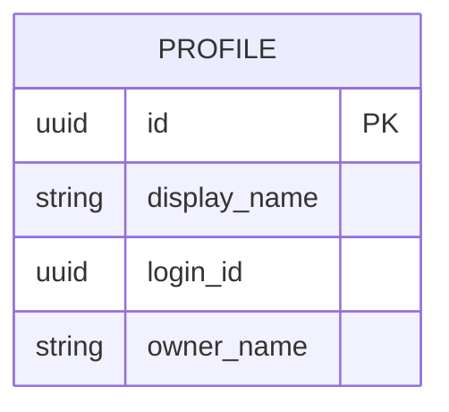
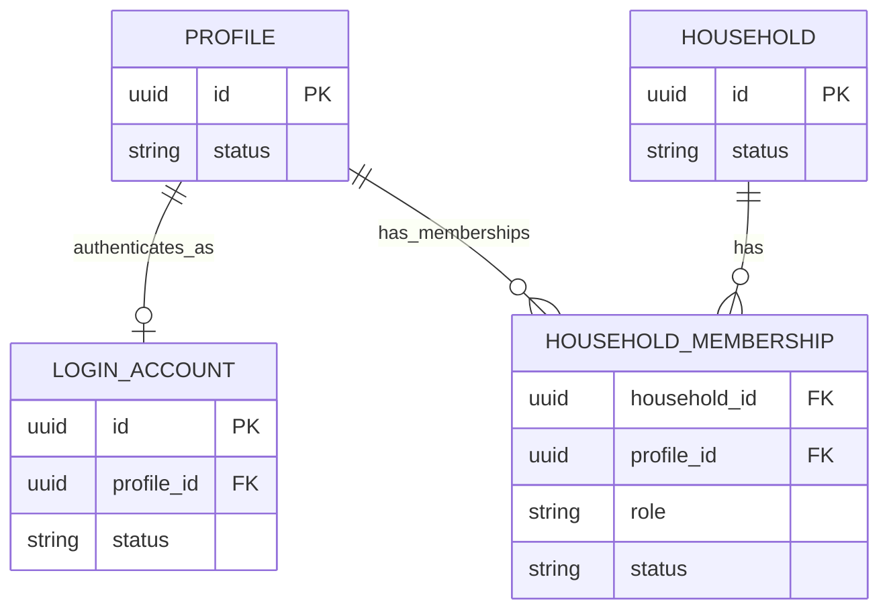
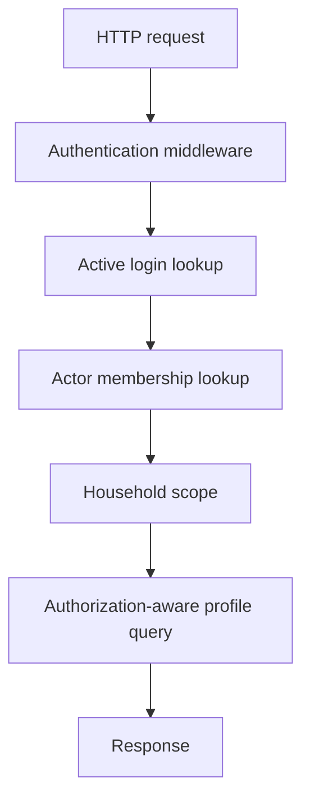

# Architecture

This document expands the system design behind the Household Access System. It is documentation only; executable migrations, domain types, endpoints, and repository code are intentionally out of scope for the current scaffold.

## Legacy Model

The legacy system stores people in `profiles`. The nullable `login_id` field is overloaded as identity, authentication capability, and household grouping key. Profiles sharing the same `login_id` are treated as members of one household.

This creates several architectural problems:

- profiles without logins cannot naturally belong to households
- owners are represented by names instead of profile references
- a household member cannot independently authenticate if another profile already defines the household identity
- authorization is implemented by repeated `login_id` comparisons across application code
- missing or duplicated identifiers can accidentally broaden access

## Proposed Model

The proposed model separates four concepts:

- `profiles`: real people and retained business records
- `login_accounts`: authentication capability associated with one profile
- `households`: explicit authorization boundary
- `household_memberships`: profile membership and role inside a household

The model intentionally derives access from relationships rather than storing duplicated grants. A login authenticates one profile. A profile may have multiple historical membership records, while a partial unique index permits at most one active membership per profile. The profile's active membership identifies the household. All active profiles in that household are manageable by that login.

## Aggregate Boundaries

The practical aggregate boundary for authorization is the household. Membership changes, owner transfer, household closure, and profile removal from a household must preserve household-level invariants.

Profile lifecycle and login lifecycle are separate boundaries:

- disabling a login affects authentication but not retained profile data
- archiving a profile affects domain visibility and authorization targets
- removing membership affects household access but not necessarily the underlying profile

These boundaries avoid destructive side effects from a single operation such as "delete member."

## Source of Authenticated Identity

The source of authenticated identity is trusted authentication middleware. Downstream handlers receive an authenticated login identifier or principal derived from a verified session or token.

Handlers must not trust request body fields, query parameters, or route parameters as proof of household access. A route may contain a `profile_id`, but the repository or service must resolve that profile through an authorization-aware query using the actor login.

## Authorization Decision Flow

Authorization answers this question: which active profiles may the authenticated login manage? The answer is computed by joining from `login_accounts` to the actor's active membership and then to target active memberships in the same household.

Requests for a specific profile should use either:

- a single query that joins through the actor's authorized household scope, or
- a prior service-level scope check followed by a scoped repository query

Returning `404` for inaccessible profiles is usually preferable to revealing that another household's profile exists.

## Transaction Boundaries

The following operations require transactions:

- creating a household with its first owner membership
- transferring ownership
- removing a member
- archiving a profile that currently owns a household
- closing or archiving a household
- creating or disabling a login account when the resulting authorization behavior must be immediately consistent

Transactions should lock the relevant household and membership rows when concurrent changes could violate invariants. For example, owner transfer must avoid an intermediate committed state with zero owners or multiple owners.

## Owner Transfer Workflow

A safe owner transfer should:

1. Begin a transaction.
2. Lock the household and active membership rows.
3. Confirm the current owner is active.
4. Confirm the new owner profile has an active membership in the same household.
5. Change the current owner membership role to `member`.
6. Change the new owner membership role to `owner`.
7. Validate that exactly one active owner remains.
8. Commit.

A partial unique index can prevent two active owners from being committed. A deferred constraint trigger or equivalent validation can ensure the transaction does not commit with zero active owners.

## No Separate Permission-Grant Table

A separate `household_access` or permission-grant table is not needed for the current requirements. Every active login associated with an active profile in a household can manage all active profiles in that household.

Adding a separate grant table now would introduce duplication:

- grants could drift from memberships
- deletion would need to update both membership and grants
- migration would need to backfill another security-sensitive table
- authorization would become harder to explain and audit

The current model keeps access derivable from canonical relationships.

## Future Extension Possibilities

The design can be extended later if requirements become more granular:

- delegated access to only selected profiles
- read-only versus manage permissions
- caregiver or staff access across households
- time-limited invitations
- external organization roles
- emergency access workflows

Those extensions are out of scope for this prototype. If introduced, they should be modeled explicitly and should not weaken the household-wide invariant described here.

## Trade-offs

Centralized authorization adds discipline to repository APIs and service boundaries, but it reduces the chance that one handler forgets a household filter. Deferred database validation can make invariants stronger, but triggers are less visible than service code and require careful testing. Soft deletion supports retention and audit needs, but every authorization query must consistently filter `active`, `disabled`, `archived`, and `removed` states.
